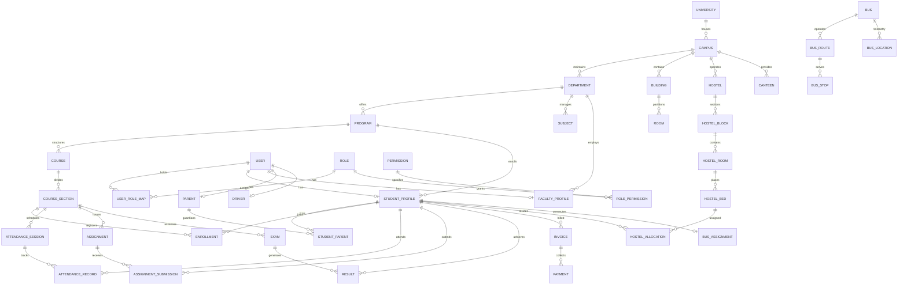

# Entity Relationship (ER) Diagram - Apex UMS

```mermaid
erDiagram
    UNIVERSITY ||--o{ CAMPUS : houses
    CAMPUS ||--o{ DEPARTMENT : maintains
    CAMPUS ||--o{ BUILDING : contains
    CAMPUS ||--o{ HOSTEL : operates
    CAMPUS ||--o{ CANTEEN : provides
    BUILDING ||--o{ ROOM : partitions

    DEPARTMENT ||--o{ PROGRAM : offers
    DEPARTMENT ||--o{ SUBJECT : manages
    DEPARTMENT ||--o{ FACULTY_PROFILE : employs

    PROGRAM ||--o{ COURSE : structures
    PROGRAM ||--o{ STUDENT_PROFILE : enrolls

    USER ||--o{ USER_ROLE_MAP : holds
    ROLE ||--o{ USER_ROLE_MAP : assigns
    ROLE ||--o{ ROLE_PERMISSION : grants
    PERMISSION ||--o{ ROLE_PERMISSION : specifies

    USER ||--o| STUDENT_PROFILE : has
    USER ||--o| FACULTY_PROFILE : has
    USER ||--o| PARENT : has
    USER ||--o| DRIVER : has

    STUDENT_PROFILE ||--o{ STUDENT_PARENT : links
    PARENT ||--o{ STUDENT_PARENT : guardians

    COURSE ||--o{ COURSE_SECTION : divides
    COURSE_SECTION ||--o{ ENROLLMENT : registers
    STUDENT_PROFILE ||--o{ ENROLLMENT : joins

    COURSE_SECTION ||--o{ ATTENDANCE_SESSION : schedules
    ATTENDANCE_SESSION ||--o{ ATTENDANCE_RECORD : tracks
    STUDENT_PROFILE ||--o{ ATTENDANCE_RECORD : attends

    COURSE_SECTION ||--o{ ASSIGNMENT : issues
    ASSIGNMENT ||--o{ ASSIGNMENT_SUBMISSION : receives
    STUDENT_PROFILE ||--o{ ASSIGNMENT_SUBMISSION : submits

    COURSE_SECTION ||--o{ EXAM : assesses
    EXAM ||--o{ RESULT : generates
    STUDENT_PROFILE ||--o{ RESULT : achieves

    STUDENT_PROFILE ||--o{ INVOICE : billed
    INVOICE ||--o{ PAYMENT : collects

    HOSTEL ||--o{ HOSTEL_BLOCK : sections
    HOSTEL_BLOCK ||--o{ HOSTEL_ROOM : contains
    HOSTEL_ROOM ||--o{ HOSTEL_BED : places
    HOSTEL_BED ||--o{ HOSTEL_ALLOCATION : assigned
    STUDENT_PROFILE ||--o{ HOSTEL_ALLOCATION : resides

    BUS ||--o{ BUS_ROUTE : operates
    BUS_ROUTE ||--o{ BUS_STOP : serves
    BUS ||--o{ BUS_LOCATION : telemetry
    STUDENT_PROFILE ||--o| BUS_ASSIGNMENT : commutes
```
